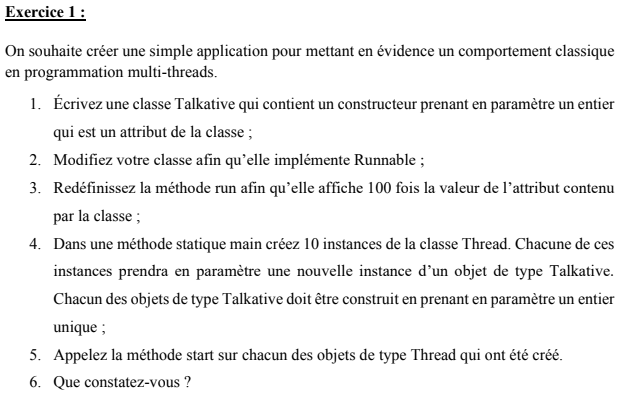
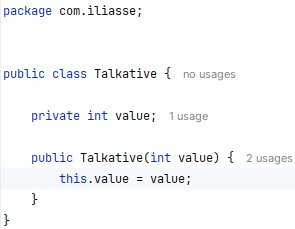
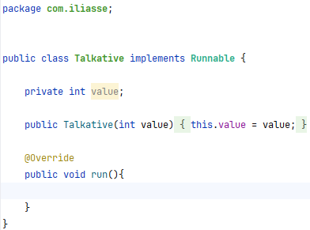
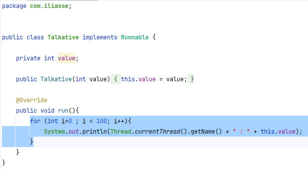
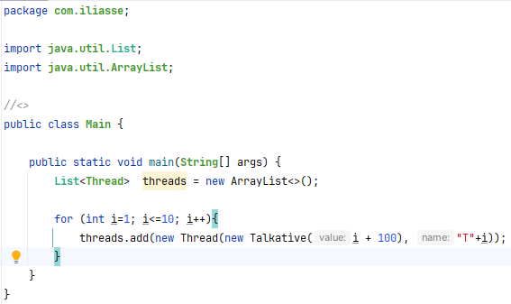
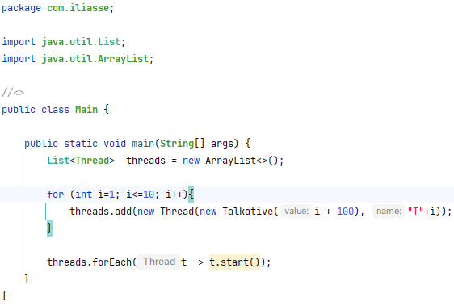
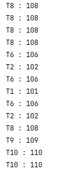

 
<h5>Reponse</h5>

<b>1 - Écrivez une classe Talkative qui contient un constructeur prenant en paramètre un entier
qui est un attribut de la classe</b>

 

<b>2 - Modifiez votre classe afin qu’elle implémente Runnable</b>

 

<b>3 - Redéfinissez la méthode run afin qu’elle affiche 100 fois la valeur de l’attribut contenu
par la classe</b>

 

<b>4 - Dans une méthode statique main créez 10 instances de la classe Thread. Chacune de ces
instances prendra en paramètre une nouvelle instance d’un objet de type Talkative. Chacun des objets de type Talkative doit être construit en prenant en paramètre un entier
unique</b>

 

<b>5 - Appelez la méthode start sur chacun des objets de type Thread qui ont été créé.</b>

 

<b>6 - Que constatez-vous</b>

On remarque que les Threads sont exécutés en parallèle, et que on n'a pas le contôle sur l'ordre d'éxecution des Thread 
ainsi que la durée qui sera alouée à chaque fois à un thread pour le traitement par le CPU.
 
Le composant du système d'expoitation qui gère ces deux caractéristiques c'est le schudler, mais en java on a la possibilité de 
gérer l'ordonnencement et la durée qui sera alouée à chaque thread pour qu'il soit traité par le CPU via la méthode setPriority(), ainsi 
le thread qui a la priorité maximale sera exécuté en premier et aura une durrée de traitement maximale par rapport aux autres threads 

